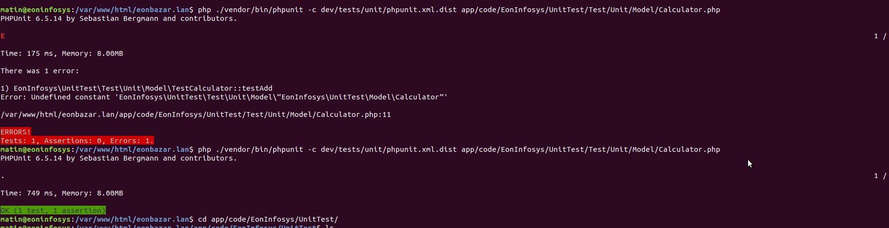

### UnitTest

## Magento 2 EonInfosys_UnitTest

Magento 2 Module UnitTest Sample implementation

Executing The Test Cases For Unit Testing After the implementation, it is necessary to run the test. There are multiple ways to run the test.

### CLI

The client method for execution will run only a single test file. Here you need to define the file path and run the below command from the Magento root.

    php ./vendor/bin/phpunit -c dev/tests/unit/phpunit.xml.dist app/code/EonInfosys/UnitTest/Test/Unit/Model/Calculator.php

   

### Magento Commands

Magento commands will help you to execute all the tests written by Magento and by you. You need to run the below command from the root of Magento.

    php bin/magento dev:tests:run unit

### PHPStrom

This process is a little lengthy. IDE integration is required to run the test using PHPStrom. Magento comes with the file named phpunit.xml.dist, which resides under dev/tests/unit/phpunit.xml.dist. By using this file, PHPUnit knows where to test cases.

Rename this file to phpunit.xml from phpunit.xml.dist and define you Model Class in the directory below

    ../../../EonInfosys/UnitTest/Test/Unit

Now PHPUnit can find your test, and now you will be able to run the test from Toolbar > Run > Edit Configuration.

### Developer

Thank you for watching guide.If you have any questions about this practice, please feel free to leave a comment or Please do not hesitate to contact me don't worry about charge I try to help  on my little knowledge, if you need me to join your Magento project especially extension development.

- Abdul Matin

- Skype/gmail/hangout:matinict

- Mobile/What-apps: +8801717676441

- Github: https://github.com/matinict

- Magento Developer Program Member & Community Contributors
